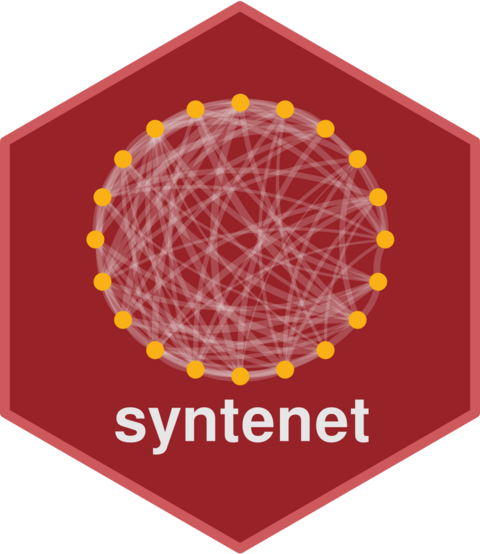

<!-- README.md is generated from README.Rmd. Please edit that file -->

```{r, include = FALSE}
knitr::opts_chunk$set(
    collapse = TRUE,
    comment = "#>",
    fig.path = "man/figures/README-",
    out.width = "100%"
)
```

# syntenet 

<!-- badges: start -->
[](https://github.com/almeidasilvaf/syntenet/issues)
[](https://lifecycle.r-lib.org/articles/stages.html#experimental)
[](https://github.com/almeidasilvaf/syntenet/actions)
[](https://codecov.io/gh/almeidasilvaf/syntenet?branch=master)
<!-- badges: end -->

The goal of `syntenet` is to infer synteny networks from whole-genome 
protein sequence data and analyze them. Anchor pairs from synteny analyses are
treated as an undirected unweighted graph (i.e., a synteny network),
and users can perform: 

- **Synteny detection** using a native implementation of the 
[MCScanX algorithm](https://doi.org/10.1093/nar/gkr1293), a C++ program that 
has been modified and ported to R with Rcpp. This way, users do not need to 
install MCScanX beforehand, because `magrene` has its own implementation
of the same algorithm.
- **Synteny network inference** by treating anchor pairs as edges of a graph;
- **Network clustering** using the Infomap algorithm;
- **Phylogenomic profiling**, which consists in identifying which species 
contain which clusters. This analysis can reveal highly conserved synteny
clusters and taxon-specific ones (e.g., family- and order-specific clusters); 
- **Microsynteny-based phylogeny reconstruction** with maximum likelihood,
which can be achieved by inferring a phylogeny from a binary matrix of
phylogenomic profiles with IQTREE.

## Installation instructions

Get the latest stable `R` release from [CRAN](http://cran.r-project.org/). Then install `syntenet` from [Bioconductor](http://bioconductor.org/) using the following code:

```{r 'install', eval = FALSE}
if (!requireNamespace("BiocManager", quietly = TRUE)) {
    install.packages("BiocManager")
}

BiocManager::install("syntenet")
```

And the development version from [GitHub](https://github.com/almeidasilvaf/syntenet) with:

```{r 'install_dev', eval = FALSE}
BiocManager::install("almeidasilvaf/syntenet")
```

## Citation

Below is the citation output from using `citation('syntenet')` in R. Please
run this yourself to check for any updates on how to cite __syntenet__.

```{r 'citation', eval = requireNamespace('syntenet')}
print(citation('syntenet'), bibtex = TRUE)
```

Please note that the `syntenet` was only made possible thanks to many other R and bioinformatics software authors, which are cited either in the vignettes and/or the paper(s) describing this package.

## Code of Conduct

Please note that the `syntenet` project is released with a [Contributor Code of Conduct](http://bioconductor.org/about/code-of-conduct/). By contributing to this project, you agree to abide by its terms.

## Development tools

* Continuous code testing is possible thanks to [GitHub actions](https://www.tidyverse.org/blog/2020/04/usethis-1-6-0/)  through `r BiocStyle::CRANpkg('usethis')`, `r BiocStyle::CRANpkg('remotes')`, and `r BiocStyle::CRANpkg('rcmdcheck')` customized to use [Bioconductor's docker containers](https://www.bioconductor.org/help/docker/) and `r BiocStyle::Biocpkg('BiocCheck')`.
* Code coverage assessment is possible thanks to [codecov](https://codecov.io/gh) and `r BiocStyle::CRANpkg('covr')`.
* The [documentation website](http://almeidasilvaf.github.io/syntenet) is automatically updated thanks to `r BiocStyle::CRANpkg('pkgdown')`.
* The code is styled automatically thanks to `r BiocStyle::CRANpkg('styler')`.
* The documentation is formatted thanks to `r BiocStyle::CRANpkg('devtools')` and `r BiocStyle::CRANpkg('roxygen2')`.

For more details, check the `dev` directory.

This package was developed using `r BiocStyle::Biocpkg('biocthis')`.


